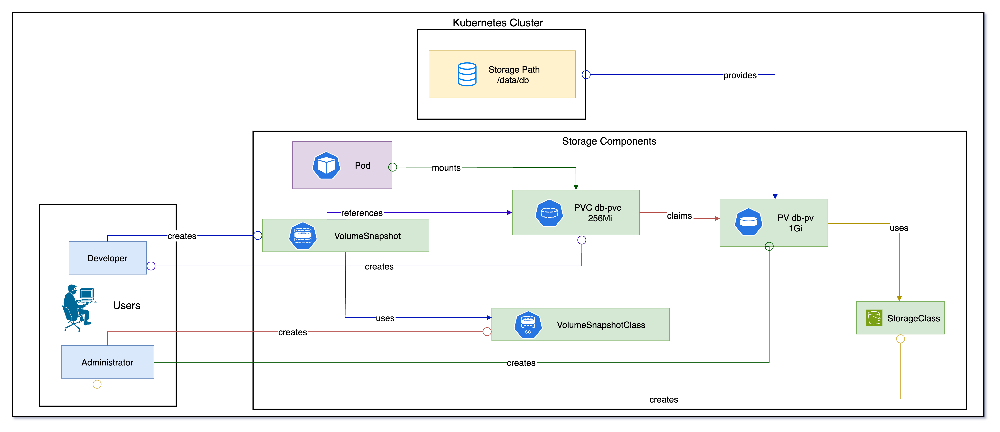

# 🌟 Mastering Kubernetes Persistent Storage: A Deep Dive into PV & PVC

[](https://github.com/TheToriqul/k8s-persistent-volumes)
[](https://github.com/TheToriqul/k8s-persistent-volumes/stargazers)


## 📋 Project Overview

This project represents my comprehensive exploration of Kubernetes storage management, focusing on implementing and mastering persistent storage solutions. Through hands-on development with Persistent Volumes (PV) and Persistent Volume Claims (PVC), I've created a practical guide for handling stateful applications in Kubernetes. This repository demonstrates real-world implementation patterns and best practices for maintaining data persistence in containerized environments.

## 🎯 Key Objectives

- Master Kubernetes storage architecture and implementation
- Develop expertise in PV and PVC management
- Implement various storage access modes and policies
- Create production-ready storage solutions
- Document comprehensive storage management patterns
- Build practical examples for real-world scenarios

## 🏗️ Project Architecture

<figure>
  <p align="center">
      
      <p align="center">Kubernetes Storage Architecture: Shows the relationship between Persistent Volumes (PV), Persistent Volume Claims (PVC), and Volume Snapshots in a cluster, demonstrating how storage components interact from Administrator provisioning to Developer usage.</p> 
  </p>
</figure>

## 💻 Technical Stack

- **Platform**: 
  - Kubernetes 1.21+
  - Container Runtime Interface (CRI)
  - Container Storage Interface (CSI)
- **Storage**:
  - Persistent Volumes (PV)
  - Persistent Volume Claims (PVC)
  - StorageClasses
  - Dynamic Provisioners
- **Development Environment**:
  - Ubuntu 20.04 LTS
  - VS Code with Kubernetes extensions
  - Docker CE
- **Monitoring & Management**:
  - kubectl
  - Kubernetes Dashboard
  - Storage metrics
- **Version Control**: Git

## 🚀 Getting Started

<details>
<summary>🐳 Prerequisites</summary>

- Kubernetes cluster (v1.21 or higher)
- kubectl command-line tool
- Access to cluster storage resources
- Basic understanding of Kubernetes concepts
- Git for version control
- VS Code or similar text editor
- Docker installed and configured
- Storage backend (local or cloud provider)

</details>

<details>
<summary>⚙️ Installation</summary>

1. Clone the repository:
   ```bash
   git clone https://github.com/TheToriqul/k8s-persistent-volumes.git
   ```

2. Navigate to the project directory:
   ```bash
   cd k8s-persistent-volumes
   ```

3. Create storage directories:
   ```bash
   sudo mkdir -p /data/db
   sudo chmod 777 /data/db
   ```

4. Verify cluster access:
   ```bash
   kubectl cluster-info
   kubectl get nodes
   ```

5. Set up storage classes:
   ```bash
   kubectl apply -f storage-class/
   ```

</details>

<details>
<summary>🎮 Usage</summary>

1. Create a persistent volume:
   ```bash
   kubectl apply -f manifests/pv.yaml
   ```

2. Create a persistent volume claim:
   ```bash
   kubectl apply -f manifests/pvc.yaml
   ```

3. Deploy a stateful application:
   ```bash
   kubectl apply -f manifests/statefulset.yaml
   ```

4. Verify the deployment:
   ```bash
   kubectl get pv,pvc,pods
   ```

For detailed commands and explanations, refer to the [reference-commands.md](reference-commands.md) file.

</details>

## 💡 Key Learnings

### Technical Mastery:

1. Implementation of storage solutions in Kubernetes
2. Understanding of storage access modes and policies
3. Expertise in storage lifecycle management
4. Proficiency in storage troubleshooting
5. Advanced knowledge of volume provisioning

### Professional Development:

1. Cloud-native storage architecture design
2. Best practices in storage management
3. Systematic problem-solving approach
4. Technical documentation skills
5. Infrastructure planning

### 🔄 Future Enhancements

<details>
<summary>View Planned Improvements</summary>

1. Implement dynamic volume provisioning
2. Add cloud provider integrations
3. Create automated backup solutions
4. Develop storage monitoring system
5. Implement disaster recovery
6. Add performance benchmarking

</details>

## 🙌 Contribution

Contributions are welcome! Feel free to:
- [Open an issue](https://github.com/TheToriqul/k8s-persistent-volumes/issues)
- [Submit a pull request](https://github.com/TheToriqul/k8s-persistent-volumes/pulls)
- [Fork the repository](https://github.com/TheToriqul/k8s-persistent-volumes/fork)

## 📧 Connect with Me

- 📧 Email: toriqul.int@gmail.com
- 📱 Phone: +65 8936 7705, +8801765 939006
- 🌐 LinkedIn: [@TheToriqul](https://www.linkedin.com/in/thetoriqul/)
- 🐙 GitHub: [@TheToriqul](https://github.com/TheToriqul)
- 🌍 Portfolio: [TheToriqul.com](https://thetoriqul.com)

Let's connect and discuss cloud-native technologies!

## 👏 Acknowledgments

- [Poridhi for providing comprehensive labs and inspiring this project](https://devops.poridhi.io/)
- The Kubernetes community for excellent documentation
- Fellow developers who provided valuable feedback
- Open source contributors who inspire continuous learning

---

Thank you for exploring this repository! I hope you find it valuable for understanding Kubernetes storage management. Happy learning! 🚀